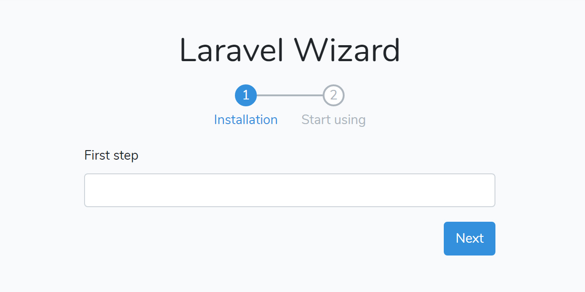

# Laravel Wizard

[![Latest Version on Packagist][ico-version]][link-packagist]
[![Software License][ico-license]](LICENSE.md)
[![CI Build Status][ico-ci]][link-ci]
[![Style CI Build Status][ico-style-ci]][link-style-ci]
[![Total Downloads][ico-downloads]][link-downloads]

A web setup wizard for Laravel application.

> This package is adapted from [smajti1/laravel-wizard](https://github.com/smajti1/laravel-wizard).



## Table of Contents

- [Laravel Wizard](#laravel-wizard)
  - [Table of Contents](#table-of-contents)
  - [Version Compatibility](#version-compatibility)
  - [Install](#install)
  - [Usage](#usage)
    - [1. Generate controller and wizard steps](#1-generate-controller-and-wizard-steps)
    - [2. Set steps](#2-set-steps)
    - [3. Install wizard steps CSS package](#3-install-wizard-steps-css-package)
  - [Cache Driver](#cache-driver)
    - [Database](#database)
  - [Controller](#controller)
    - [Setting Configuration](#setting-configuration)
  - [Customize View](#customize-view)
  - [Step](#step)
    - [Get cache data](#get-cache-data)
    - [Step repository](#step-repository)
    - [Passing data to views](#passing-data-to-views)
    - [Save data on other step](#save-data-on-other-step)
    - [Set relationships model](#set-relationships-model)
  - [Common Problems](#common-problems)
  - [Commands](#commands)

## Version Compatibility

 | Laravel Wizard | Laravel                | PHP    |
 | :------------- | :--------------------- | :----- |
 | 1.0.x          | 5.5                    | ^7.0   |
 | 1.1.x          | ^5.6                   | ^7.1.3 |
 | 2.0.x,2.1.x    | ^5.6\|^6.x             | ^7.1.3 |
 | 2.2.x          | ^5.6\|^6.x\|^7.x       | ^7.1.3 |
 | 2.3.x          | ^5.6\|^6.x\|^7.x\|^8.x | ^7.1.3 |

## Install

Via Composer:

```bash
composer require ycs77/laravel-wizard
```

Publish config:

```bash
php artisan vendor:publish --tag=wizard-config
```

The this package view is use [Bootstrap 4](https://getbootstrap.com/), but if you don't want to use, you can publish views to custom it, or [Customize View](#customize-view):

```bash
php artisan vendor:publish --tag=wizard-views
```

## Usage

### 1. Generate controller and wizard steps

Now you can quickly generate the wizard controller and the wizard steps:

```bash
php artisan make:wizard User NameStep,EmailStep
```

This command generate the `UserWizardController`, `NameStep`, `EmailStep` class, and append the wizard route to `routes/web.php`.

*routes/web.php*
```php
...

Wizard::routes('wizard/user', 'UserWizardController', 'wizard.user');
```

> If you can't use auto append route, you can set `config/wizard.php` attribute `append_route` to `false`.

### 2. Set steps

This is generated NameStep class, you can to `model` method set the model, to `rules` method set form validation, and save `$data` to your database via the `saveData` method, for example:

*app/Steps/User/NameStep.php*
```php
<?php

namespace App\Steps\User;

use App\User;
use Illuminate\Http\Request;
use Illuminate\Support\Arr;
use Ycs77\LaravelWizard\Step;

class NameStep extends Step
{
    /**
     * The step slug.
     *
     * @var string
     */
    protected $slug = 'name';

    /**
     * The step show label text.
     *
     * @var string
     */
    protected $label = 'Name';

    /**
     * Set the step model instance or the relationships instance.
     *
     * @param  \Illuminate\Http\Request  $request
     * @return \Illuminate\Database\Eloquent\Model|\Illuminate\Database\Eloquent\Relations\Relation|null
     */
    public function model(Request $request)
    {
        return User::find(1);
    }

    /**
     * Save this step form data.
     *
     * @param  \Illuminate\Http\Request  $request
     * @param  array|null  $data
     * @param  \Illuminate\Database\Eloquent\Model|\Illuminate\Database\Eloquent\Relations\Relation|null  $model
     * @return void
     */
    public function saveData(Request $request, $data = null, $model = null)
    {
        $data = Arr::only($data, 'name');
        $model->update($data);
    }

    /**
     * Validation rules.
     *
     * @param  \Illuminate\Http\Request  $request
     * @return array
     */
    public function rules(Request $request)
    {
        return [
            'name' => 'required',
        ];
    }
}
```

And add steps view, for example:

*resources/views/steps/user/name.blade.php*
```blade
<div class="form-group">
    <label for="name">Name</label>
    <input type="text" name="name" id="name" class="form-control{{ $errors->has('name') ? ' is-invalid' : '' }}" value="{{ old('name') ?? $step->data('name') }}">
    @if ($errors->has('name'))
        <span class="invalid-feedback">{{ $errors->first('name') }}</span>
    @endif
</div>
```

*resources/views/steps/user/email.blade.php*
```blade
<div class="form-group">
    <label for="email">E-mail</label>
    <input type="email" name="email" id="email" class="form-control{{ $errors->has('email') ? ' is-invalid' : '' }}" value="{{ old('email') ?? $step->data('email') }}">
    @if ($errors->has('email'))
        <span class="invalid-feedback">{{ $errors->first('email') }}</span>
    @endif
</div>
```

Next, browse the URL `/wizard/user`, start use the Laravel Wizard.

### 3. Install wizard steps CSS package

The CSS for this package default view is based on the [Bootstrap Steps](https://github.com/ycs77/bootstrap-steps), use NPM installation to use:

```bash
npm install bootstrap-steps
```

Or use yarn:

```bash
yarn add bootstrap-steps
```

Import to app.scss file and run `npm run dev` or `yarn run dev`:

*resources/sass/app.scss*
```scss
...

@import '~bootstrap/scss/bootstrap';
@import '~bootstrap-steps/scss/bootstrap-steps';
```

## Cache Driver

### Database

In order to use the `database` wizard cache driver, you will need a database table to hold the wizards cache data. To generate a migration that creates this table, run the `wizard:table` Artisan command:

```
php artisan wizard:table

php artisan migrate
```

## Controller

### Setting Configuration

Add `wizardOptions` property to `controller`, you can use `cache`, `driver`, `connection`, `table` options to override configuration.

*app/Http/Controllers/UserWizardController.php*
```php
/**
 * The wizard options.
 *
 * @var array
 */
protected $wizardOptions = [
    'cache' => false,
];
```

## Customize View

First, publish layouts:

```bash
php artisan vendor:publish --tag=wizard-views
```

Now you can customize `resources/views/vendor/wizard/*.blade.php` in your laravel project.

But if you want custom only one wizard view base view, you can copy the views from `resources/views/vendor/wizard/*.blade.php` to `resources/views/wizards/user/*.blade.php`. (`user` is `wizardName` property value on your wizard controller),

## Step

### Get cache data

For example, `FirstStep` has `name` and `email` fields, `SecondStep` has `age` and `phone` fields. you can use step's `data` method to get step data:

```php
$name = $firstStep->data('name');
// Bob

$data = $secondStep->data();
// ['age' => '30', 'phone' => '0900111222']
```

### Step repository

Step repository saves all steps data, if you want use other step, you need to use it:

From wizard:

```php
$stepRepo = $wizard->stepRepo();
```

From step:

```php
$stepRepo = $step->getRepo();
```

Get previous step:

```php
$prevStep = $step->getRepo()->prev();
```

Get next step:

```php
$nextStep = $step->getRepo()->next();
```

Step repository all can use method detailed reference: https://github.com/ycs77/laravel-wizard/blob/master/src/StepRepository.php

### Passing data to views

Because each step is injected into the view of the step, so just add the method to return the data in the step class. For example, pass the data of the select options to view:

*app/Steps/User/NameStep.php*
```php
<?php

...

class NameStep extends Step
{
    ...

    public function getOptions()
    {
        return [
            'Taylor',
            'Lucas',
        ];
    }
}

```

*resources/views/steps/user/name.blade.php*
```blade
<div class="form-group">
    <label for="name">Select name</label>
    <select id="name" name="name" class="form-control{{ $errors->has('name') ? ' is-invalid' : '' }}">
        <option value="">Select...</option>
        @foreach ($step->getOptions() as $option)
            <option value="{{ $option }}" @if (old('name') ?? $step->data('name') === $option) @endif>{{ $option }}</option>
        @endforeach
    </select>

    @if ($errors->has('name'))
        <span class="invalid-feedback">{{ $errors->first('name') }}</span>
    @endif
</div>

```

The `getOptions` method is custom, can be changed at will.

### Save data on other step

Suppose there are now two Steps `NameStep` and `EmailStep`.
First, don't set the Model for all Steps, but don't use the last one:

*app/Steps/User/NameStep.php*
```php
...

class NameStep extends Step
{
    ...

    public function model(Request $request)
    {
        //
    }

    public function saveData(Request $request, $data = null, $model = null)
    {
        //
    }
}
```

Next, receive all the data in the last Step and save Model:

*app/Steps/User/EmailStep.php*
```php
...

class EmailStep extends Step
{
    ...

    public function model(Request $request)
    {
        return new User();
    }

    public function saveData(Request $request, $data = null, $model = null)
    {
        $data = $this->getRepo()->original()->reduce(function ($carry, $step) {
            return array_merge($carry, $step->data());
        }, []);

        $model->fill($data)->save();
    }
}
```

### Set relationships model

Similarly, you can set the relationships model in `model` method of the `Step`.

```php
use Illuminate\Support\Arr;

/**
 * Set the step model instance or the relationships instance.
 *
 * @param  \Illuminate\Http\Request  $request
 * @return \Illuminate\Database\Eloquent\Model|\Illuminate\Database\Eloquent\Relations\Relation|null
 */
public function model(Request $request)
{
    return $request->user()->posts();
}

/**
 * Save this step form data.
 *
 * @param  \Illuminate\Http\Request  $request
 * @param  array|null  $data
 * @param  \Illuminate\Database\Eloquent\Model\Illuminate\Database\Eloquent\Relations\Relation|null  $model
 * @return void
 */
public function saveData(Request $request, $data = null, $model = null)
{
    $data = Arr::only($data, ['title', 'content']);
    $model->create($data);
}
```

## Common Problems

**Error: "Serialization of 'Illuminate\Http\UploadedFile' is not allowed"**:

Set `cache` in `config/wizard.php` to `false`:

```php
'cache' => false,
```

Or set to your WizardController `wizardOptions` method:

```php
protected $wizardOptions = [
    'cache' => false,
];
```

If disable cache, the data will be saved in the data immediately after each step is sent. If you are afraid to save the data repeatedly, you can hide the Prev button, or use `Model::updateOrCreate()` (https://laravel.com/docs/6.x/eloquent#other-creation-methods).

## Commands

**Make wizard**:

The `make:wizard` command and `make:wizard:controller` command difference, is `make:wizard` command will append route and no confirm generate step.

```bash
php artisan make:wizard User NameStep,EmailStep
```

**Make controller**:

The `make:wizard:controller` command only generate the `WizardController`, `NameStep`, `EmailStep` class.

```bash
php artisan make:wizard:controller UserController --steps=NameStep,EmailStep
```

**Make step**:

```bash
php artisan make:wizard:step NameStep
```

With step label and wizard:

```bash
php artisan make:wizard:step NameStep --label="Name" --slug=name --wizard=user
```

Add custom view path:

```bash
php artisan make:wizard:step NameStep --label="Name" --slug=name --view=steps.user.name --wizard=user
```

[ico-version]: https://img.shields.io/packagist/v/ycs77/laravel-wizard?style=flat-square
[ico-license]: https://img.shields.io/badge/license-MIT-brightgreen?style=flat-square
[ico-ci]: https://img.shields.io/travis/ycs77/laravel-wizard?style=flat-square
[ico-style-ci]: https://github.styleci.io/repos/190876726/shield?style=flat-square
[ico-downloads]: https://img.shields.io/packagist/dt/ycs77/laravel-wizard?style=flat-square

[link-packagist]: https://packagist.org/packages/ycs77/laravel-wizard
[link-ci]: https://travis-ci.org/ycs77/laravel-wizard
[link-style-ci]: https://github.styleci.io/repos/190876726
[link-downloads]: https://packagist.org/packages/ycs77/laravel-wizard
